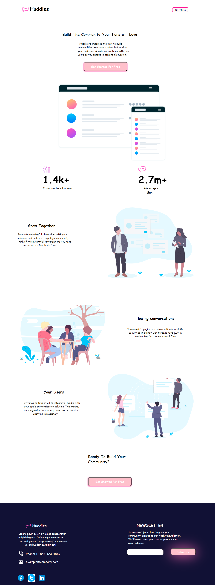

# Frontend Mentor - Huddle landing page with curved sections solution

This is a solution to the [Huddle landing page with curved sections challenge on Frontend Mentor](https://www.frontendmentor.io/challenges/huddle-landing-page-with-curved-sections-5ca5ecd01e82137ec91a50f2). Frontend Mentor challenges help you improve your coding skills by building realistic projects. 

## Table of contents

  - [The challenge](#the-challenge)
  - [Screenshot](#screenshot)
  - [Links](#links)
  - [Built with](#built-with)
  - [Author](#author)
  - [Acknowledgments](#acknowledgments)

### The challenge

Users should be able to:

- View the optimal layout for the site depending on their device's screen size
- See hover states for all interactive elements on the page

### Screenshot

### Links

- Solution URL: [solution URL](https://github.com/Muneeb2721/Muneeb2721.git)
- Live Site URL: [live site URL](https://muneeb2721.github.io/Muneeb2721/)

### Built with

- Semantic HTML5 markup
- CSS custom properties
- Flexbox
- Mobile-first workflow

## Author

- GitHub - [Muneeb2721](https://github.com/Muneeb2721)
- Frontend Mentor - [@Muneeb2721](https://www.frontendmentor.io/profile/Muneeb2721)
- LinkedIn - [Muneeb Nadeem](https://www.linkedin.com/in/muneebnadeem/)

## Acknowledgments

I am thankful to the team of Frontend Mentor that they are providing opportunity to the Frontend Developers to polish their skills with the given task. I have also improved my skills through practicing the tasks.
Thank you again for the Frontend Mentors
Regards: Muneeb Ndeem
@Muneeb2721